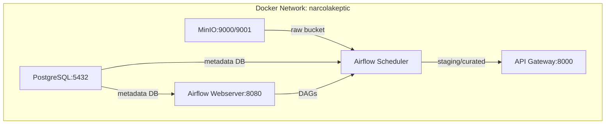

# NarcoLakePtic Architecture Documentation

> Technical architecture document for the NarcoLakePtic data lake project.

---

## 1. System Overview

NarcoLakePtic is a data lake pipeline that ingests, transforms, and exposes drug-related data from two official public sources:
- **Druglib.com** (via UCI ML Repository) — Patient drug reviews
- **openFDA /drug/label API** — Official FDA drug labeling data

The pipeline implements a **three-layer data lake architecture**:

```
┌─────────────────┐     ┌─────────────────┐     ┌─────────────────┐
│     RAW         │────►│    STAGING      │────►│    CURATED      │
│    (MinIO)      │     │    (Parquet)    │     │    (Parquet)    │
│  Immutable      │     │  Cleaned,       │     │  Analytics-     │
│  Source Data    │     │  Normalized     │     │  Ready Datasets │
└─────────────────┘     └─────────────────┘     └─────────────────┘
        │                       │                       │
        ▼                       ▼                       ▼
   fetch_druglib.py      raw_to_staging.py       staging_to_curated.py
   fetch_openfda.py      (validation)            (aggregations, joins)
        │                       │                       │
        └───────────────────────┼───────────────────────┘
                                ▼
                    ┌───────────────────────┐
                    │   Airflow DAG         │
                    │  narcolakeptic_       │
                    │  pipeline             │
                    └───────────────────────┘
                                │
                                ▼
                    ┌───────────────────────┐
                    │   API Gateway         │
                    │   (FastAPI)           │
                    └───────────────────────┘
```

---

## 2. Data Lake Layers

### 2.1 Raw Layer (MinIO/S3)
- **Storage**: MinIO (S3-compatible object storage)
- **Bucket**: `raw`
- **Format**: CSV (original source format)
- **Organization**: Prefix-based (`druglib/`, `openfda/`)
- **Characteristics**: Immutable, append-only, contains exact source data

| Object | Source | Description |
|--------|--------|-------------|
| `druglib/druglib_reviews_static.csv` | UCI ML Repository | ~215k patient reviews |
| `openfda/openfda_drug_labels_api.csv` | openFDA API | ~260k drug labels |

### 2.2 Staging Layer (Local Parquet)
- **Storage**: Local filesystem (`data/staging/`)
- **Format**: Apache Parquet (columnar, compressed)
- **Characteristics**: Cleaned, normalized, schema-enforced, partitioned by source

| File | Source | Rows | Key Transformations |
|------|--------|------|---------------------|
| `druglib.parquet` | Druglib | ~150k | URL removal, numeric casting, deduplication, text cleaning |
| `openfda.parquet` | openFDA | ~200k | Datetime parsing, deduplication, control char removal |

### 2.3 Curated Layer (Local Parquet)
- **Storage**: Local filesystem (`data/curated/`)
- **Format**: Apache Parquet
- **Characteristics**: Analytics-ready, enriched, joined, aggregated

| Dataset | Grain | Description |
|---------|-------|-------------|
| `drug_catalog.parquet` | 1 row / drug | Unique drugs from openFDA with metadata completeness flags |
| `review_analytics.parquet` | 1 row / drug | Aggregated patient review metrics from Druglib |
| `substance_profiles.parquet` | 1 row / substance | Enriched substance profiles joining openFDA + Druglib |
| `combined_analysis.parquet` | 1 row / match | Cross-source joined records on generic_name |

---

## 3. Technology Stack

### 3.1 Core Technologies

| Component | Technology | Version | Justification |
|-----------|------------|---------|---------------|
| **Object Storage** | MinIO | Latest | S3-compatible, self-hosted, PDF requirement |
| **Processing** | Pandas | 2.2.0 | Team familiarity, data fits in memory, mature API |
| **Orchestration** | Apache Airflow | 2.9.0 | PDF requires DVC or Airflow; Airflow chosen for production features |
| **API Gateway** | FastAPI | 0.109.0 | Async, auto-docs (Swagger), type safety |
| **Validation** | Custom + Pandas | - | Lightweight, no external dependency |
| **Serialization** | Parquet | - | Columnar, compression, schema evolution |
| **Containerization** | Docker Compose | 3.8 | Multi-service orchestration, consistent environments |

### 3.2 Why These Choices?

#### MinIO for Raw Layer
- **Alternatives**: Elasticsearch, local filesystem, HDFS
- **Rationale**: 
  - PDF explicitly requires S3-compatible storage for Raw zone
  - Self-hosted, no cloud costs
  - Integrates with existing Python MinIO client
  - Supports bucket policies, versioning

#### Parquet for Staging/Curated
- **Alternatives**: CSV, Avro, ORC
- **Rationale**:
  - Columnar storage → efficient analytical queries
  - Built-in compression (snappy) → 70-90% size reduction
  - Schema evolution support
  - Native Pandas support (`read_parquet`/`to_parquet`)

#### Airflow for Orchestration
- **Alternatives**: Prefect (current), DVC, Dagster
- **Rationale**:
  - PDF explicitly requires **DVC or Airflow**
  - Production-grade: retries, scheduling, monitoring, UI
  - XCom for inter-task communication
  - Mature ecosystem, battle-tested

#### FastAPI for API Gateway
- **Alternatives**: Flask, Django REST Framework, Starlette
- **Rationale**:
  - Native async support for I/O-bound operations
  - Automatic OpenAPI/Swagger docs
  - Pydantic validation built-in
  - High performance (Starlette + Uvicorn)

---

## 4. Data Flow Description

### 4.1 Ingestion (Raw Layer)
```
Druglib (UCI CSV)     openFDA (REST API)
      │                     │
      ▼                     ▼
fetch_druglib.py      fetch_openfda.py
      │                     │
      └─────────┬───────────┘
                ▼
         MinIO (raw bucket)
         s3://raw/druglib/
         s3://raw/openfda/
```

**Details**:
- **Druglib**: Single static CSV download from UCI ML Repository
- **openFDA**: Paginated API with date-range partitioning (bypasses 25k skip limit)
- **Rate limiting**: 0.4s delay between requests (40 req/min without API key)
- **Error handling**: Retry logic (3 attempts), exponential backoff

### 4.2 Transformation: Raw → Staging
```
MinIO (raw) → Local CSV → process_druglib() → data/staging/druglib.parquet
MinIO (raw) → Local CSV → process_openfda() → data/staging/openfda.parquet
```

**Druglib Cleaning**:
1. Remove URLs from drug names
2. Cast ratings to numeric (coerce errors → NaN)
3. Drop rows missing drug_name or rating
4. Deduplicate on `reviewID`
5. Clean text fields (strip, replace 'nan')

**openFDA Cleaning**:
1. Parse `effective_time` to datetime
2. Drop rows missing `spl_id`
3. Deduplicate on `spl_id`
4. Remove control characters, normalize whitespace

### 4.3 Transformation: Staging → Curated
```
data/staging/*.parquet → build_curated() → data/curated/*.parquet
```

**Outputs**:
1. **Drug Catalog**: Deduplicated drugs (substance + brand + manufacturer) with completeness flags
2. **Review Analytics**: Per-drug aggregations (mean rating, effectiveness, side effects)
3. **Substance Profiles**: Per-substance metrics enriched with review scores
4. **Combined Analysis**: Inner join on `generic_name` for cross-source analysis

---

## 5. API Gateway Endpoints

| Endpoint | Method | Description | Parameters |
|----------|--------|-------------|------------|
| `/health` | GET | Service health check | - |
| `/stats` | GET | Layer metrics (counts, sizes, rows) | - |
| `/raw` | GET | List MinIO objects | `prefix`, `limit`, `download` |
| `/raw/{object}` | GET | Download raw object | `object` (path) |
| `/staging` | GET | List staging files | `file`, `limit` |
| `/staging/{file}` | GET | Get staging data | `limit`, `offset`, `format` |
| `/curated` | GET | List curated files | `file`, `limit` |
| `/curated/{file}` | GET | Get curated data | `limit`, `offset`, `format` |

**Format options**: `json` (default), `csv`, `parquet`

---

## 6. Airflow DAG Design

### 6.1 DAG Structure
```
health_check
    ├─► fetch_druglib ──► raw_to_staging_druglib
    └─► fetch_openfda ──► raw_to_staging_openfda
                    │
                    └─► staging_to_curated ──► pipeline_summary
```

### 6.2 Task Details

| Task ID | Callable | Description |
|---------|----------|-------------|
| `health_check` | `task_health_check` | Verify MinIO & data dirs |
| `fetch_druglib` | `fetch_druglib()` | Ingest Druglib → MinIO |
| `fetch_openfda` | `fetch_openfda()` | Ingest openFDA → MinIO |
| `raw_to_staging_druglib` | `process_druglib()` | Clean + validate → Parquet |
| `raw_to_staging_openfda` | `process_openfda()` | Clean + validate → Parquet |
| `staging_to_curated` | `build_curated()` | Aggregate + validate → Parquet |
| `pipeline_summary` | `task_pipeline_summary` | Log execution summary |

### 6.3 Scheduling
- **Schedule**: `@daily` (00:00 UTC)
- **Catchup**: False
- **Max Active Runs**: 1
- **Retries**: 1 (5 min delay)
- **Timeout**: 2 hours per task

---

## 7. Data Quality & Validation

### 7.1 Validation Layers

| Layer | Checks |
|-------|--------|
| **Raw → Staging** | Required columns, no null keys, rating ranges (1-5), date parsing |
| **Staging → Curated** | Referential integrity, unique keys, numeric ranges, completeness flags |

### 7.2 Custom Exceptions
- `ValidationError` — Schema/data quality failures
- `IngestionError` — Source fetch failures
- `ProcessingError` — Transformation failures

### 7.3 Monitoring
- Row counts at each stage via XCom
- Data quality summaries logged per task
- Pipeline summary task aggregates all metrics

---

## 8. Deployment Architecture



### 8.1 Services

| Service | Port | Health Check |
|---------|------|--------------|
| MinIO API | 9000 | `/minio/health/live` |
| MinIO Console | 9001 | - |
| PostgreSQL | 5432 | `pg_isready` |
| Airflow Webserver | 8080 | `airflow jobs check` |
| API Gateway | 8000 | `/health` |

---

## 9. Security Considerations

- **No authentication** on API Gateway (internal/educational use)
- **MinIO credentials** via environment variables
- **openFDA API key** optional (increases rate limit 6x)
- **Non-root containers** for API Gateway
- **Secrets** not in code (use `.env` file)

---

## 10. Scalability Notes

| Bottleneck | Current Limit | Mitigation |
|------------|---------------|------------|
| Pandas memory | ~1M rows | Switch to Polars/DuckDB for larger data |
| openFDA pagination | 25k skip limit | Date partitioning (implemented) |
| Airflow LocalExecutor | Single machine | Switch to CeleryExecutor for distributed |
| API Gateway | Single process | Add gunicorn workers, Redis cache |

---

*Document version: 1.0*  
*Last updated: 2026-07-12*  
*Generated as part of PDF Section 5 deliverables*